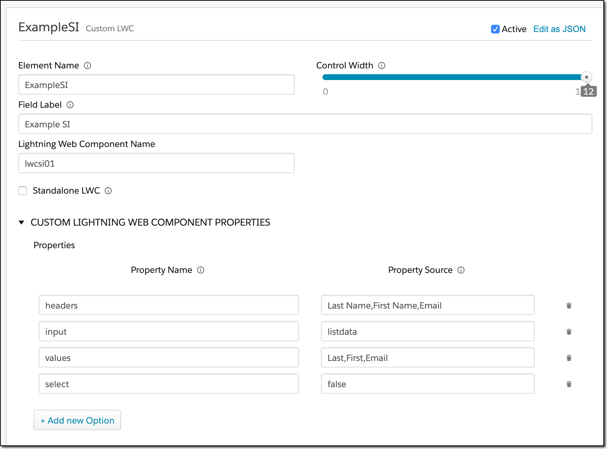
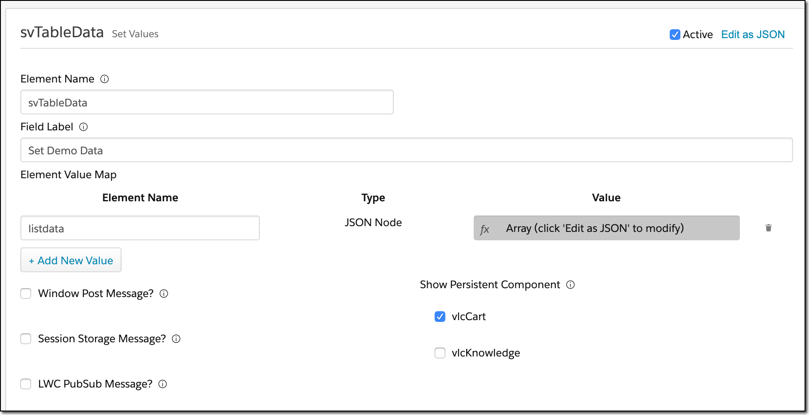
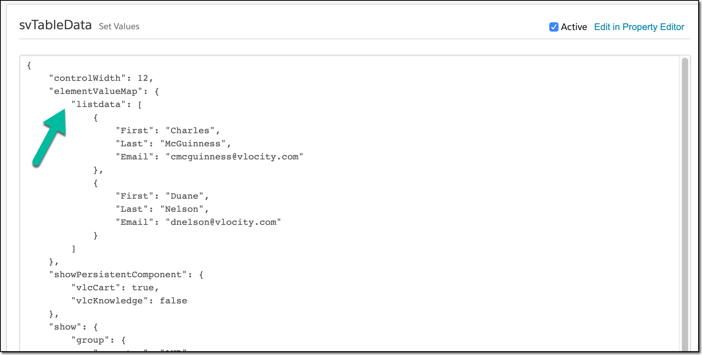
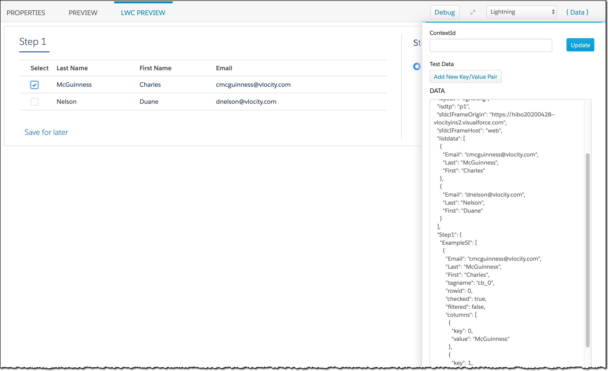
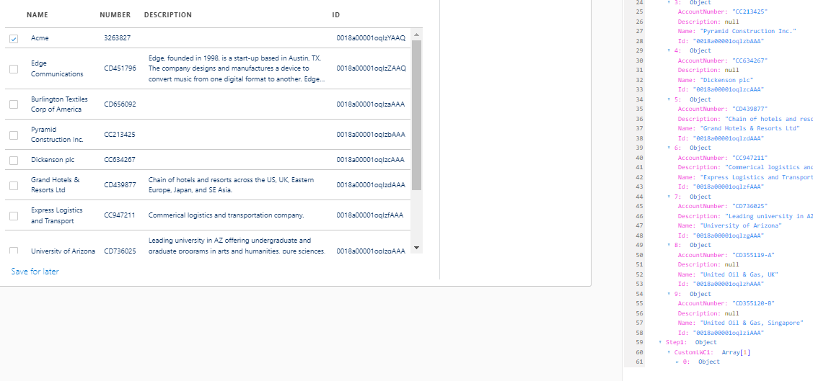
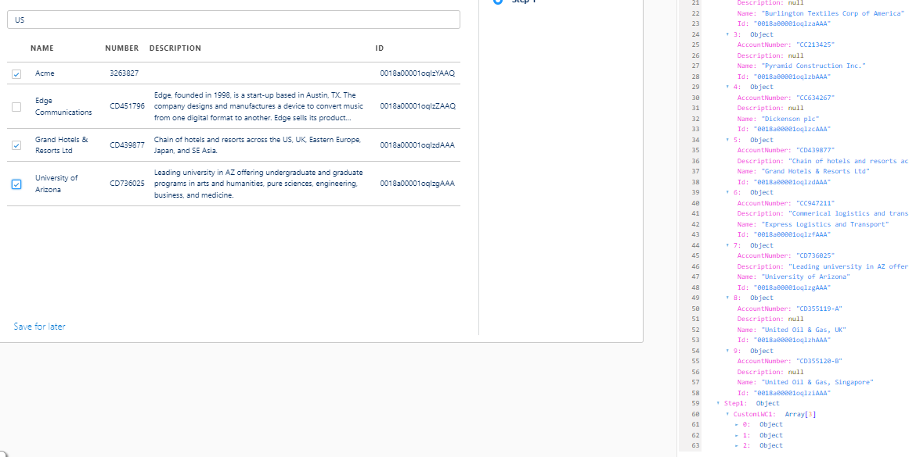

# lwcsi01

## A LWC Replacement for Selectable Items

This is a Lightning Web Component that is intended to be used inside of Vlocity's OmniScript to provide similar functionality to a selectable items element.  There are some differences, however, in its behavior, but the differences are minor and easy to adapt to.

As a reminder, a Selectable Items behaves as a filter: you pass it an array of data (often a table), it displays the table and allows the user to select zero, one, or many rows (depending upon requirements), and the value of the element is the selected items.

## Installing the LWC

The LWC is comprised of three files:

1. lwcsi01.html
2. lwcsi01.js
3. lwcsi01.js-meta.xml

There are other files in this repository, but they are not to be deployed.

One way to deploy this is to drag the directory holding the repository into Visual Studio Code under the lwc directory (and then deleting all but the above three files).

## Using the LWC

If you are familiar with Selectable Items, you will find this similar.  One important difference is that the source of the data can be different from the element itself; if you do that (which I recommend), it leaves the original data unmolested.

Here's a sample configuration we'll walk through:

The configuration is driven by the following custom properties:

| Name    | Description                                                  |
| ------- | ------------------------------------------------------------ |
| headers | A list of the titles to display for the columns, in order    |
| input   | The name of the data element holding the data to be displayed |
| values  | The names of the columns to be displayed, in order           |
| select  | optional, if "f" or "false", it will remove the select box from each row |

While the source of the data can definitely be a DataRaptor or Integration Procedure, you can also use a Set Values to set dummy data.  For example:

Because the structure of the data (an array of key:value pairs), you have to Edit as JSON to see the actual data:

In this case, I've created a variable called "listdata" which has two rows.

All this, together, produces the output that looks like (with select=true):

You can see here the input, listdata, and the output, Step1.ExampleSI, in the Data JSON.

Input to filter the list in all fields

Value selected persisted even after filter aplied

## Notes and Caveats

In order to test the LWC, even in preview, you have to activate your OmniScript.  This takes ~2 minutes (+/- quite a bit).  If the OmniScript is not activated, and you preview, this LWC will not render.  That's not harmful, except that it will be missing.  But be aware that testing with the LWC is going to be slow going.

There's not much error checking in this so far, and so if you make a configuration mistake expect interesting results.

### Credits

Kirk Leibert <kleibert@vlocity.com>

Charles McGuinness <cmcguinness@vlocity.com>

Victor Yuzo
